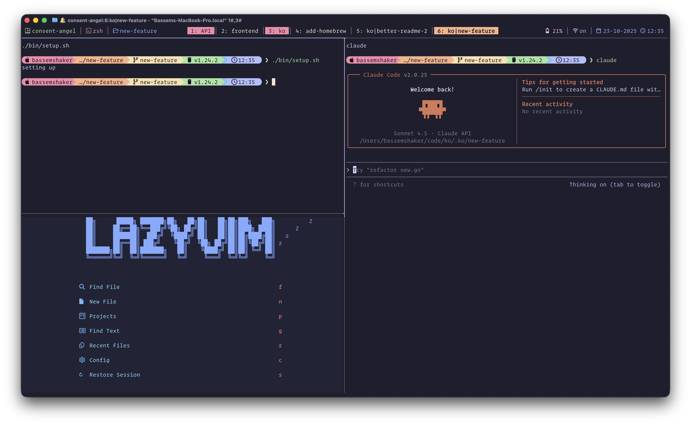

# koh

## git worktree tmux automation

`koh` is a CLI tool written in Go that creates git worktrees and sets up a configurable development environment with a single command.


## What it does

### `koh new <worktree-name>`

Creates a new development environment:

1. Creates a new git worktree in `.koh/<worktree-name>`
2. Opens a new tmux window with dynamically configured panes:
   - **First pane**: Runs your setup script (e.g., `./bin/setup`)
   - **Additional panes**: Runs any commands you configure (e.g., dev server, editor, etc.)

### `koh cleanup <worktree-name>`

Cleans up after you're done:

1. Closes the tmux window for the worktree
2. Removes the git worktree from `.koh/<worktree-name>`

## Prerequisites

- [git](https://git-scm.com/)
- [tmux](https://github.com/tmux/tmux)
- A setup script in your repository (optional, configurable via `koh init`)

## Installation

### Homebrew (recommended)

```bash
brew tap bshakr/koh
brew install koh
```

### Building from source

```bash
# Clone the repository
git clone https://github.com/bshakr/koh.git
cd koh

# Or use go directly
go build -o koh
```

## Usage

### First time setup

Navigate to your git repository and run:

```bash
koh init
```

This will guide you through setting up your configuration (setup script path and pane commands).

### Creating a new worktree session

```bash
koh new <worktree-name>
```

Example:

```bash
koh new feature-auth
```

This will:

- Create a worktree at `.koh/feature-auth`
- Set up your configured tmux environment with panes running your specified commands

### Normal development workflow

Once your session is set up:

1. Work in your configured environment (editor, dev server, etc.)
2. Make commits as normal
3. Push your branch and create a PR when ready

### Cleaning up after you're done

When your work is merged and you want to clean up:

```bash
koh cleanup feature-auth
```

This will:

- Close the tmux window with all its panes
- Remove the git worktree

**Note:** Make sure you've pushed or merged your changes before running cleanup!

## Commands

```bash
koh new <worktree-name>      # Create a new worktree and tmux session
koh cleanup <worktree-name>  # Close tmux session and remove worktree
koh list                     # List all koh worktrees
koh init                     # Interactive configuration setup
koh config                   # View current configuration
koh help                     # Show help message
```

## How it works

`koh` creates a new git worktree in the `.koh/` directory and opens a tmux window with panes configured based on your `.kohconfig` file. The first pane runs your setup script, and additional panes run any commands you've configured (dev server, editor, etc.).

The cleanup command finds the tmux window by name and closes it, then removes the git worktree. If you have uncommitted changes, git will warn you and you'll need to either commit them or use `git worktree remove --force` manually.

## Worktree Management

All worktrees are created in a `.koh/` directory at the root of your repository. This keeps your repository organized and makes it easy to:

- See all active worktrees: `ls .koh/`
- Clean up a worktree: `koh cleanup <name>`
- Manually remove worktrees: `git worktree remove .koh/<name>`
- List all worktrees: `git worktree list`

You may want to add `.koh/` to your `.gitignore` file.

**Tip:** Use `koh cleanup` instead of manually removing worktrees - it will close the tmux window and clean up the worktree in one command!

## Configuration

Before creating your first worktree, run `koh init` to set up your configuration. The tool will prompt you for:

- Path to your setup script (if you have one)
- Additional commands to run in tmux panes

The configuration is stored in `.kohconfig` at your repository root and can be updated anytime with `koh init`.

## Contributing

Feel free to submit issues or pull requests!

## License

MIT
